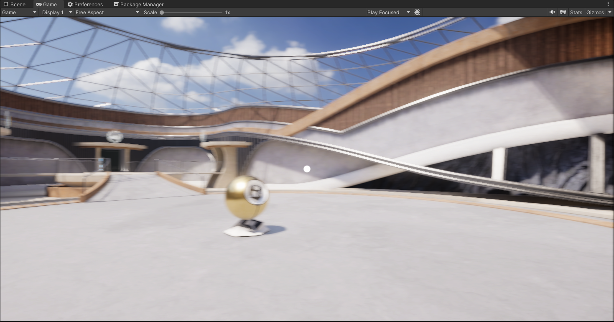
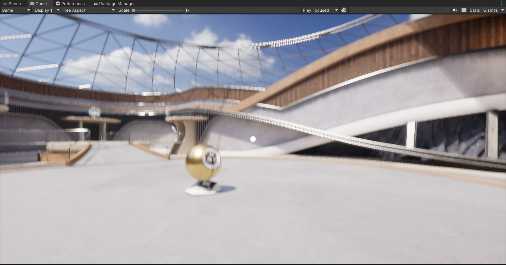
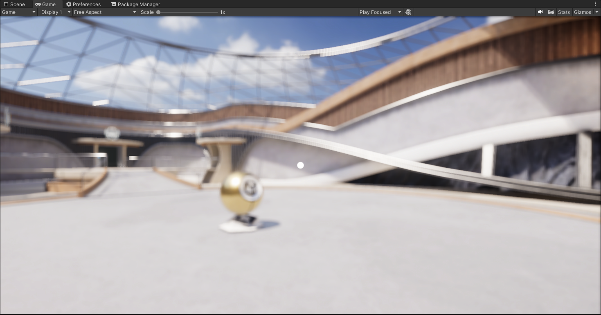
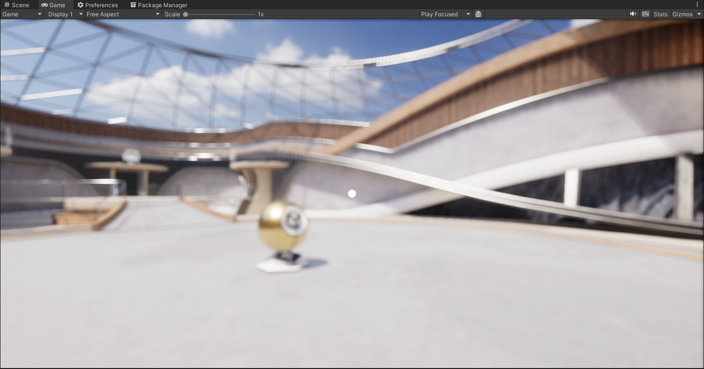
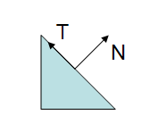
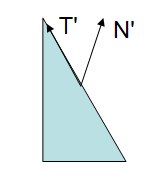

自定义Unity Renderer Feature合集

# 1. [高斯模糊](Runtime/GaussianBlur)

<div align="center">
  <table>
    <tr>
      <td align="center">
        
        水平模糊
      </td>
      <td align="center">
        
        竖直模糊
      </td>
    </tr>
    <tr>
      <td align="center">
        
        先水平再竖直模糊
      </td>
      <td align="center">
        
        二维卷积模糊
      </td>
    </tr>
  </table>
</div>

<!-- <video controls src="Documentation/images/高斯模糊.mp4" title="高斯模糊"></video> -->


# 2. [屏幕空间体积光](Runtime/VolumetricLight)

[参考教程](https://learn.u3d.cn/tutorial/CustomRendererFeatureTutorials03)

核心部分代码：

```cg
fixed4 frag(v2f i) : SV_Target
{
    fixed4 col = fixed4(0.0f,0.0f,0.0f,1.0f);

    float2 ray = i.uv-_Center.xy;
    
    //将光源方向的颜色进行一定程度的叠加
    for(int i=0;i<NUM_SAMPLES;++i)
    {
        float scale=1.0f-_BlurWidth*(float(i)/float(NUM_SAMPLES-1));
        col.rgb+=tex2D(_MainTex,(ray*scale)+_Center.xy).rgb/float(NUM_SAMPLES);
    }
    return col*_Intensity;
}
```

<!-- <video controls src="Documentation/images/屏幕空间体积光.mp4" title="屏幕空间体积光"></video> -->


# 3. [物体法线调试](Runtime/NormalDebug)


<div align="center">
  <table>
    <tr>
      <td align="center">
        
        矫正后法线
      </td>
      <td align="center">
        
        矫正前法线
      </td>
    </tr>
  </table>
</div>

## *关于[法线矫正](http://www.lighthouse3d.com/tutorials/glsl-12-tutorial/the-normal-matrix/)*





法线矫正矩阵为：Transpose(Inverse(M))

Unity实现：

```hlsl
float3 normalWS = mul(normalOS, (float3x3)GetWorldToObjectMatrix());
```